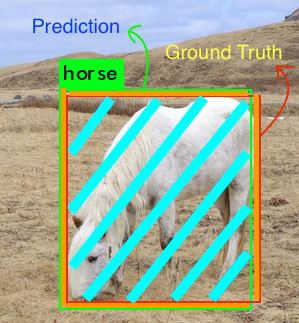
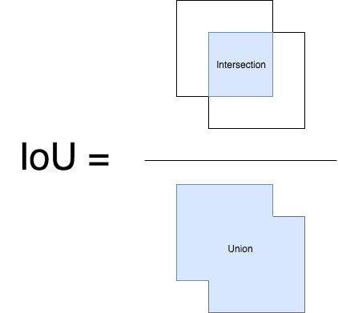

# 学习问题的性能度量及目标检测评价

### 基础

Precison:positive的检准率  ; Recall:positive的检出率

#### [深度探讨机器学习中的ROC和PR曲线](https://blog.csdn.net/taoyanqi8932/article/details/54409314)

两者的定义不同

AP采用的是PR曲线

使用区别:如果是不平衡类，正样本的数目非常的稀有，而且很重要，PR表现的效果会更好

### AP

参看[wiki-Evaluation measures (information retrieval)](https://en.wikipedia.org/wiki/Evaluation_measures_(information_retrieval)#cite_note-voc2010-4) AP部分

AP是在各个recall下precision的均值, 

> The AP summarises the shape of the precision/recall curve, 

其具体实例参`看多标签图像分类任务的评价方法-mAP`

AP是综合precision和recall计算出的，所以对于偏斜类应该也是可以的，同时也解释了AP不会很高的，因为precision和racall无法都很高

### [多标签图像分类任务的评价方法-mAP](http://blog.sina.com.cn/s/blog_9db078090102whzw.html)

测试/推理阶段:输入图片和groud truth label

二分类问题：对于一个输入, 计算score, 推理时根score和阈值判断P和N，评价性能时再根据ground truth的类别判断T, F; 对于N个输入, 设置不同的阈值, 可以得到一系列不同结果

多分类问题：对于一个输入, 计算各个类别的score, 推理时根据根据最大score和阈值判断P和N, 如果为P, 则预测类别为最大scorel类别，评价性能时再根据ground truth的类别判断T, F; 对于N个输入, 设置不同的阈值, 可以得到一系列不同结果, 但实际上按照以Top-n(n=1,2,..N)为P, 得到一些列不同结果

## 物体检测评价

### 基础

http://tarangshah.com/blog/2018-01-27/what-is-map-understanding-the-statistic-of-choice-for-comparing-object-detection-models/

#### IoU：Intersection over Union

IoU=intersection/Union 

#### object detection NMS：非极大值抑制

关于object detection的nms(非极大值抑制)：

在测试/推理阶段,

对于预测Class为 C的所有Bounding Box的列表B及其对应的置信度S,采用下面的计算方式：选择具有最大score的检测框M,将其从B集合中移除并加入到最终的检测结果D中.通常将B中剩余检测框中与M的IoU大于阈值Nt的框从B中移除.重复这个过程,直到B为空. 

对所有Class的Bounding Box重负上述过程

当box很多, (比如ssd由于default box很多), 可以先用置信度阈值过滤掉一部分box，再采用上述步骤, 并且每个类别最多保留n1个(如200,加入D中的前200个)数目的检测结果, 

对于一张输入图片, 通常在对所有类别NMS之后得到的结果, 还会根据score排序保留靠前的n-pic个box(最多n-pic)

### 物体检测各阶段梳理

#### 训练阶段:

输入图片和对应标签

给定Bounding box, 与ground truth 匹配, 给定各类别的置信度, 定义训练目标(定位损失和分类损失), 正负例类别均衡问题解决

#### 推理阶段: 

对于一个输入, 计算一系列的BBox及对应的各个类别的置信度, 进行非极大值抑制(类别独立), 输出一系列bbox及对应类别

#### 检测结果评价/测试阶段: 

1. 输入M张图片和对应标签

2. 对每张图片推理(每张图片最多保留n-pic个box)

3. 对于每一类别, 计算AP (这个过程应该是对于所有输入图片一起进行)  

   对NMS后结果, 取根据score排序top-n为P, 其余为N, 对于其中某一Positive, 与所在图片中该类别任一GT的IoU大于阈值(或者与所在图片中该类别所有GT的IoU的最大值大于阈值), 即为TP ,否则为FP

   参考voc论文 :

   > For a given task and class, the precision/recall curve is
   > computed from a method’s ranked output. Recall is defined
   > as the proportion of all positive examples ranked above a
   > given rank. Precision is the proportion of all examples above
   > that rank which are from the positive class

   > Detections were assigned to ground
   > truth objects and judged to be true/false positives by measuring bounding box overlap.

   对于n=1,2,…N分别执行上一步骤, 分别计算precision, recall然后可以绘制precision-recall curve 或者计算Average Precison

4. 计算mAP

   mAP=各类别AP的均值=（各类别AP求和）/类别数

   根据训练中类的分布情况，平均精度值可能会因为某些类别(具有良好的训练数据)非常高(对于具有较少或较差数据的类别)而言非常低。所以我们需要MAP可能是适中的，但是模型可能对于某些类非常好，对于某些类非常不好。因此建议在分析模型结果的同时查看个各类的平均精度，这些值也可以作为我们是不是需要添加更多训练样本的一个依据。
