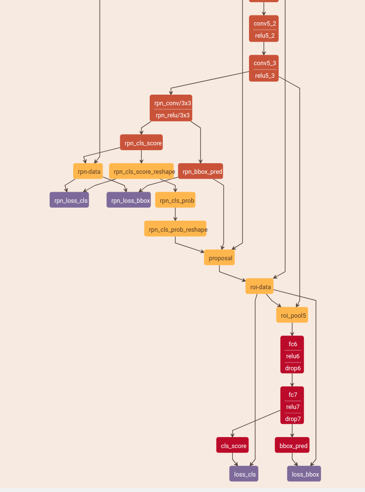

### `rpn_data layer`:

type: python AnchorTargetLayer

Assign anchors to ground-truth targets. Produces anchor classification labels and bounding-box regression targets.

包含 generate anchors

从输入的`rpn_cls_score layer`中获得feature map的长宽尺寸

包含 generate anchors

### 特点

1. 采用两阶段结构: 先产生二分类的region proposals, 再据此分类和回归, 
2. RPN网络只在单一feature map上, 通过anchor box的不同scale和aspect ratio实现多尺度多长宽比物体的检测
3. RPN采用3x3conv降维加1x1conv分类和回归
4. 对于VGG, conv5(stride16)后是RPN或ROI polling,接着再经过fc6, fc7(全连接层)到最后的多分类和回归, 对于ResNet, conv4后是RPN或ROI polling, 再经过conv5后进行多分类和回归

### 疑问

#### one stage V.S. two stage

其实one stage 跟two stage的first stage(RPN) 很像,前者只是多类而已, two stage的优点在于second stage使用的特征是first stage输出的region proposals的特征, 更好的覆盖实际物体, 而不是one stage的3x3特征

#### one scale feature map V.S. multi sacle feature maps(FM)

SSD采用后者, 随着FM尺寸减小, 定位信息逐渐减少, 语义信息逐渐增加, 同时设置归一化的scale逐渐增大, 从而用大FM检测小物体, 用小FM检测大物体

#### (1)3x3conv通道数不变+1x1conv分类和回归 V.S. (2)3x3conv分类和回归 V.S. (3)1x1conv分类和回归

#### class agnostic bounding box regression V.S. class specific bounding box regression

### 网络结构

