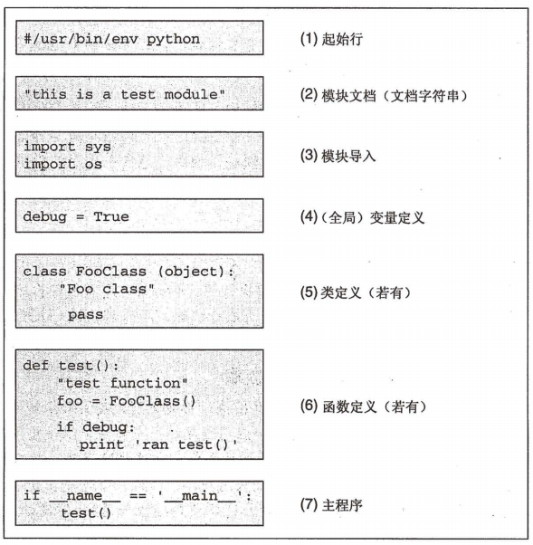

python 学习

### [CS231n Python Numpy Tutorial](http://cs231n.github.io/python-numpy-tutorial/)

### python画图: matplotlib.pyplot

[Usage Guide](https://matplotlib.org/tutorials/introductory/usage.html#sphx-glr-tutorials-introductory-usage-py): 一些基本概念, 框架

plot其实是画在Axes上的, 如果不指明, 就是使用的默认的Axes

[list of plotting commands](https://matplotlib.org/api/pyplot_summary.html).

### 正则表达式, 以及python下的使用

[正则表达式 - 语法](http://www.runoob.com/regexp/regexp-syntax.html): 对符号做了比较好的分类, 例子也不错

[正则表达式 - 元字符](http://www.runoob.com/regexp/regexp-metachar.html): 列出了各种元字符

在python下的使用: 

https://www.liaoxuefeng.com/wiki/0014316089557264a6b348958f449949df42a6d3a2e542c000/00143193331387014ccd1040c814dee8b2164bb4f064cff000

http://www.runoob.com/python/python-reg-expressions.html#flags

[有shi以来最详细的正则表达式入门教程](https://www.cnblogs.com/yunfeifei/p/4071467.html): 补充

### Ubuntu下系统的python,Anaconda的python切换

#### 命令行下的命令`some_commond`是如何工作的

1. 搜索系统`PATH`环境变量的路径, 找到`some_commond`文件

   注意,`PATH`中的变量都设置成`/`开头即根目录开头,  如果`PATH`中有`~`开头的目录, 则**只会在该目录下搜索**, 其它目录不会搜索

2. 执行或链接执行

   如果找到的`some_commond`文件是可执行程序, 则执行;

   如果找到的`some_commond`文件是可执行程序的链接, 则执行链接到的程序

#### 系统的python,Anaconda的python的程序或链接

然后, 系统的python 可以通过`which python`查看(一般为`/usr/bin/python`), 在`/usr/bin`目录下, 你就可以看到各种可执行程序或者链接, 你会发现有python2.x和python3.x

同理, 在Annacodna的`bin`目录下, 可以看到它的python可执行程序或链接

#### 解决方案一: 修改链接名

为了能够方便地在系统的python和Anaconda的python之间切换, 可以把Annacodna的`bin`目录下的`python`链接文件重命名为`pythonA`, 然后, 命令行运行`python`或`pythonA`就可以达到上述目的了

对于公共系统(服务器), 更方便的是修改自己要用的python的命令名称, 比如`cp /usr/bin/python2.7 /usr/bin/python_default`, 这样只要运行`python_default`就行,不用管别人做了什么

**这种方法只能对手动运行python命令是有效, 如果对于一些程序中的python命令则无效**

#### 解决方案二: 临时添加PATH变量

命令行运行`export PATH=/usr/bin:$PATH`, 则`/usr/bin`被临时添加到PATH的最前面, 且只在当前终端有效

添加所有在`~/.bashrc`中我自己设置的path:

```shell
export PYTHONPATH=/home/od/software/caffe-ssd-zlf/python
#export PYTHONPATH=/home/od/software/RefineDet/python#export CAFFE_ROOT=~/software/caffe-ssd-zlf
export PATH=/usr/bin:$PATH
```


### python中运行命令行命令

```python
import subprocess

cmd = "python {}/split_annotation.py --out-dir={} --imgset-file={} {}" \
                .format(CURDIR, out_dir, imgset_file, anno_file)
print(cmd)
process = subprocess.Popen(cmd.split(), stdout=subprocess.PIPE)
output = process.communicate()[0]
print(output)

or 

subprocess.call(train_job_file, shell=True)
```


### home目录, 执行文件的目录

```python
HOMEDIR = os.path.expanduser("~")
CURDIR = os.path.dirname(os.path.realpath(file))
```


### python访问系统环境变量

1.新增的系统变量使用下面的方法获取不到，关机重启即可

2.修改的环境变量是临时改变的，当程序停止时修改的环境变量失效（系统变量不会改变）

```
# 获取 系统环境 PATH 的变量
# env = os.environ.get("PATH")
print os.environ["PATH"]
# 定义环境变量
mydir = "c:\\mydir"
# 给 MYDIR赋值(临时创建的环境变量)
os.environ["TERM"] = mydir+";" + os.environ["TERM"]
print os.environ["TERM"]
```

### python环境变量

##### 打印环境变量

```python
import os
for path in os.sys.path:
    print(path)
```

##### 动态地改变Python搜索路径

```python
import sys
sys.path.append(’引用模块的地址')
#或者
import sys
sys.path.insert(0, '引用模块的地址')
```

> ​      sys.path是个列表，所以在末尾添加目录是很容易的，用sys.path.append就行了。当这个append执行完之后，新目录即时起效，以后的每次import操作都可能会检查这个目录。如同解决方案所示，可以选择用sys.path.insert(0,…)这样**新添加的目录会优先于sys.path中的其他目录被import检查**。
>
> ​      即使sys.path中存在重复，或者一个不存在的目录被不小心添加进来，也没什么大不了，Python的import语句非常聪明，它会自己应付这类问题。但是，如果每次import时都发生这种错误（比如，重复的不成功搜索，操作系统提示的需要进一步处理的错误），我们会被迫付出一点小小的性能代价。
>
> ​      程序向sys.path添加的目录只会在**此程序的生命周期之内有效**，其他所有的对sys.path的动态操作也是如此

###### 测试：

```python
import os
for path in os.sys.path:
  print(path)
print('---------insert ./python --------------')
import sys 
sys.path.insert(0,'./python')
for path in os.sys.path:
  print(path)
print('-------append ./modles --------')
sys.path.append('./modles')
for path in os.sys.path:
  print(path)
```


### main函数

> 每个文件（模块）都可以任意写一些没有缩进的代码，并且在载入时自动执行，为了区分主执行文件还是被调用的文件，Python引入了一个变量\_\_name\_\_，当文件是被调用时，\_\_name\_\_的值为模块名，当文件被执行时，\_\_name\_\_为'\_\_main\_\_'。这个特性，为测试驱动开发提供了极好的支持，我们可以在每个模块中写上测试代码，这些测试代码仅当模块被Python直接执行时才会运行，代码和测试完美的结合在一起。

[python main函数](https://www.cnblogs.com/lvxiuquan/archive/2012/07/09/2582437.html)

> 典型的Python文件结构：
>
> 

### 帮助

https://blog.csdn.net/u013810296/article/details/55509284

通用帮助函数help()

查看.py结尾的普通模块help(module_name)

查看模块下所有函数dir(module_name)

### [注释文档](https://www.cnblogs.com/cookie1026/p/6093188.html)

### 命令行参数解析

https://www.cnblogs.com/madsnotes/articles/5687079.html

```python
add_argument()方法    
    格式： ArgumentParser.add_argument(name or flags...[, action][, nargs][, const][, default][, type][, choices][, required][, help][, metavar][, dest])

name or flags - Either a name or a list of option strings, e.g. foo or -f, --foo.    # 参数选项列表
action - The basic type of action to be taken when this argument is encountered at the command line.
nargs - The number of command-line arguments that should be consumed.
const - A constant value required by some action and nargs selections.
default - The value produced if the argument is absent from the command line.
type - The type to which the command-line argument should be converted.
choices - A container of the allowable values for the argument.
required - Whether or not the command-line option may be omitted (optionals only).
help - A brief description of what the argument does.
metavar - A name for the argument in usage messages.
dest - The name of the attribute to be added to the object returned by parse_args().
```


### 计时

import time

time_start=time.time()
time_end=time.time()
print('totally cost',time_end-time_start)